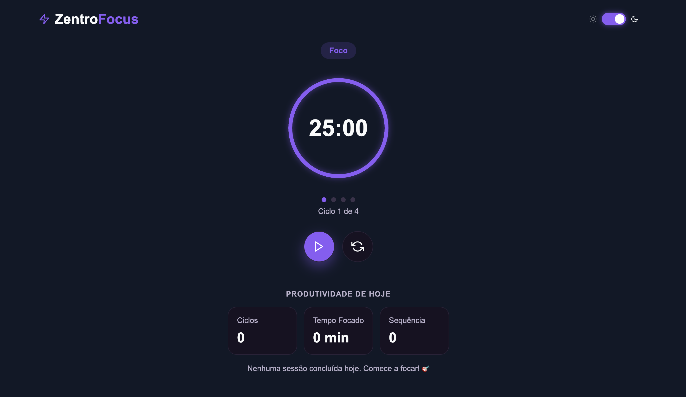

# ZentroFocus

**ZentroFocus — entre no seu estado de foco**

Um timer Pomodoro moderno desenvolvido com React + TypeScript, com foco em produtividade, design limpo e experiência do usuário.

---

## ✨ Funcionalidades

- ⏱️ Timer Pomodoro (Foco, Pausa curta e longa)
- 🔁 Ciclos automáticos
- 📊 Estatísticas diárias
- 🔥 Streak de produtividade
- 📈 Gráfico semanal (Recharts)
- 🌙 Dark / Light mode
- 💾 Persistência com localStorage
- 🎯 Animação do progresso (SVG)

---

## 🛠️ Tecnologias utilizadas

- React
- TypeScript
- Vite
- CSS
- Recharts
- React Icons

---

## 📸 Preview

---

## 👩‍💻 Desenvolvido por

Roselena Duarte 